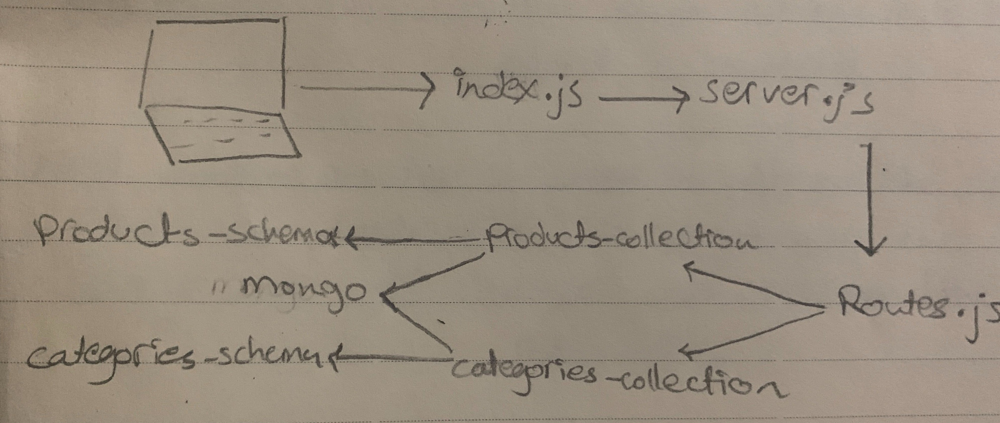

# api-server-new

# LAB - Class-10

# Author: 
  -  Amal Almomani
# lab name
  - api-server

## pull request link

  - [pull request](https://github.com/amal-401-advanced-javascript/api-server-new/pull/1)

## Links and Resources

  - [swagger hub page](https://app.swaggerhub.com/apis/AmalMAlmomani/api-server-lab-06/0.1) 
  - [Swagger documentation](https://app.swaggerhub.com/apis-docs/AmalMAlmomani/api-server-lab-06/0.1)
  - [deployed url]()
## Modules
  - Node.js
  - Postman
  - Swagger
  - HTTPie
  
## Setup
  - .env requirements
    - `PORT - 3000`

## How to use your library 
  - npm i express => express
  - npm i -D jest => jest
  - npm i supertest => lint

## How to initialize/run your application
  - to GET all record: GET - http://localhost:3000/api/v1/categories
  - to GET specific record : GET - http://localhost:3000/api/v1/categories/2
  - to UPDATE specific record: PUT - http://localhost:3030/api/v1/categories/1
  - to DELETE specific record: DELETE - http://localhost:3030/api/v1/categories/1

  
## Tests
  - nodemon or npm run dev
  - node index.js
  - npm test 
  - npm run lint 
  - npm run doc

## UML
 - 

 
